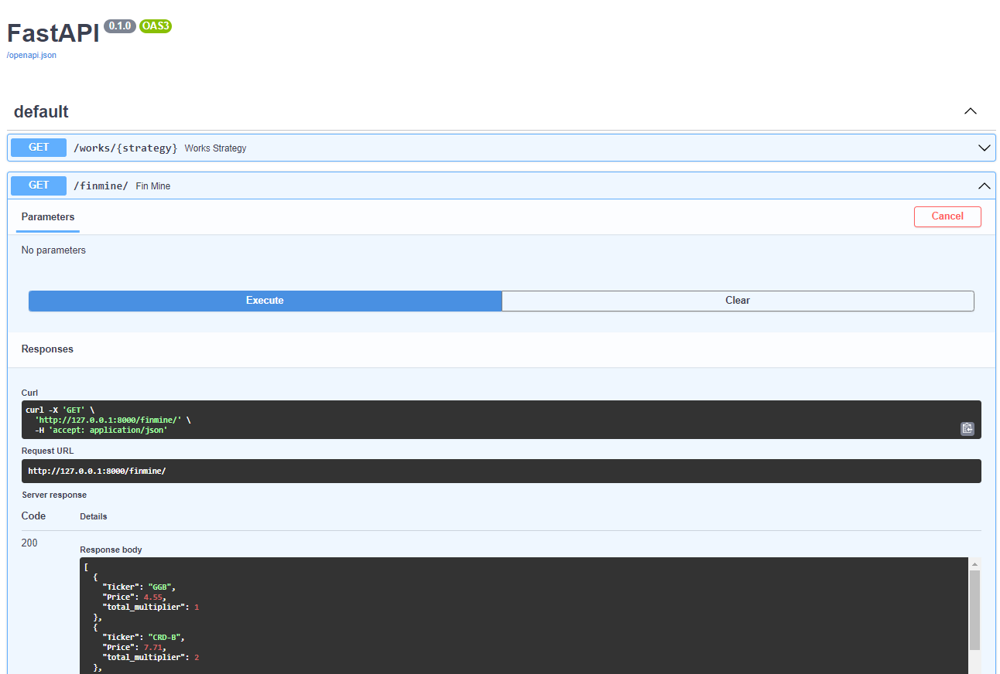

# FastAPI

This part serves as a YahooFinance and FinViz parser Project for choosing the best signals to buy or sell a stock from
FinViz using [repository](https://github.com/MelnNik/FinViz-patterns).

```
def fin_mine(): #Returns a list of 18 Tickers that allign with the strategy from https://github.com/MelnNik/Long-Term-Portfolio
```

```
def works_strategy(strategy: str): # Returns a list of Tickers for each particular strategy

#List of available strategies
strategies = [price_change_top_25, large_10, mid_50, small_50, market_leaders_25,
micro_growth_25, superior_value, market_leaders, improved_csg]
```

## 💡 Crucial Libraries

[pandas](https://pandas.pydata.org/) </br>
[FastAPI](https://fastapi.tiangolo.com/) </br>
[FinViz](https://github.com/mariostoev/finviz) </br>
[yFinance](https://pypi.org/project/yfinance/) </br>
[Finmine's analysis from here](https://github.com/MelnNik/Long-Term-Portfolio) by [@MelnNik](https://github.com/MelnNik)

## 💻 Demo



## 🔗 Build

```
docker build -t fin-mine-fastapi-docker
```


