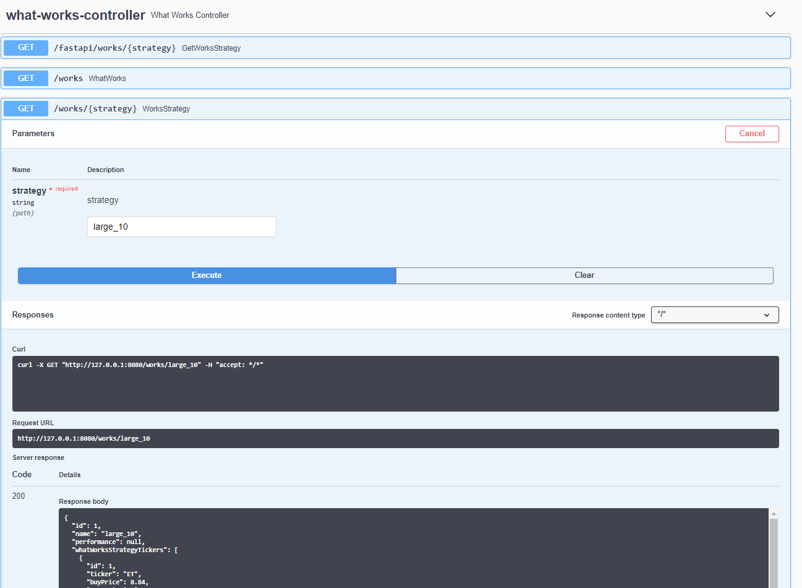

# Spring Boot

This part is responsible for getting and updating data from the FastAPI part and storing all incoming data in the
PostgreSQL Database. Spring Security is used to Authorize and Authenticate users.

## 💻 Demo




## 🔗 Build

```
mvn clean package
docker build -t fin-mine-spring-docker
```