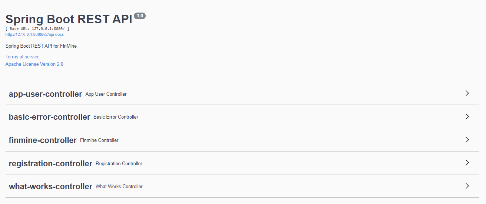

# FinMine

This project is inspired by the ideas of James O'Shaughnessy'
book [What Works on Wall Street](http://www.whatworksonwallstreet.com/). It is built to identify, track and store
information about companies, performance of which align with his most performing strategies.

## 💡 Stack

Frameworks: Spring Boot, FastAPI

Database: PostgreSQL

API Documentation: Swagger

Authentication/Authorization: Spring Security

## 💻 Demo




## 🔗 Build

Build docker images from FastAPI and SpringBoot

```
kubectl apply -f deployment.yaml
```

